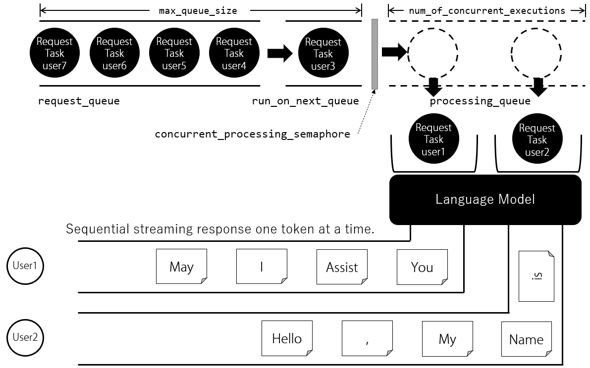

# ChatStream

A load control utility for large-scale streaming chat servers using pre-trained large language models (LLM)

## Installation

```
pip install chatstream
```


## What can it do?

### 1. Simplifies the construction of streaming chats

You can easily construct streaming chats with large pre-trained language models based on HuggingFace.

**What is a Streaming Chat**

When generating sentences with a large language model, there are methods that generate the next sentence entirely based on the inputted prompt (and the conversation history so far) before outputting it, and methods that sequentially output the next sentence one token at a time. The latter method is specifically referred to as 'streaming'. In this package, token generation is done one token at a time, and it is streamed as a response to the client. This contributes to a better user experience compared to waiting for the entire sentence to be generated.

### 2. Automatically maintains conversation history and context

By default, the HTTP session feature keeps the conversation history between the user and the language model in on-memory on the server-side. The session duration can be set, but it is basically while the browser is open. This makes it possible to have multi-round web chats with continued context.

### 3. Control of concurrent access from multiple users

It is designed with concurrent access from multiple clients in mind, and is controlled according to the following parameters specified in the constructor

`num_of_concurrent_executions` : int ... The number of concurrent sentence generation tasks to the pre-trained language model  

`max_queue_size: int` ... The size of the queue for sentence generation. When the number of concurrent sentence generation tasks falls below the limit



# How to use

The following is an example of streaming chat using `togethercomputer/RedPajama-INCITE-Chat-3B-v1` as a model

Create a chat_prompt class (chat_prompt_for_redpajama_incite.py) that generates prompts for the model and a server.py that acts as a streaming server.

**chat_prompt_for_redpajama_incite.py**


```python
from chatstream.chat_prompt import AbstractChatPrompt


class ChatPromptRedpajamaIncite(AbstractChatPrompt):

    def __init__(self):
        super().__init__()  # Call the initialization of the base class
        self.set_requester("<human>")
        self.set_responder("<bot>")

    def get_stop_strs(self):
        """
        returns special stop strings for model to finsh generating sentence
        :return:
        """
        if not self.chat_mode:
            return None
        return [
            '<|endoftext|>',
            '\n<'
            # Safety stop valve when the model generates not only AI conversations but also human parts of the conversation.
        ]

    def create_prompt(self):
        """
        Build prompts according to the characteristics of each language model
        :return:
        """
        if self.chat_mode == False:
            return self.get_requester_last_msg()

        ret = self.system;
        for chat_content in self.chat_contents:
            chat_content_role = chat_content.get_role()
            chat_content_message = chat_content.get_message()
            if chat_content_role:
                if chat_content_message:
                    merged_message = chat_content_role + ": " + chat_content_message + "\n"
                else:
                    merged_message = chat_content_role + ":"
                ret += merged_message

        return ret


# portable UT
if False:
    chatPrompt = ChatPrompt()

    chatPrompt.set_requester("<human>")
    chatPrompt.set_responder("<bot>")
    chatPrompt.add_requester_msg("Who is Alan Turing")
    chatPrompt.add_responder_msg(None)

    assert """<human>: Who is Alan Turing
<bot>:""" == chatPrompt.create_prompt()

```

**server.py**

```python
import os
import torch
from transformers import AutoTokenizer, AutoModelForCausalLM

import uvicorn
from fastapi import FastAPI, Request
from fastapi.staticfiles import StaticFiles
from fastsession import FastSessionMiddleware, MemoryStore

from chat_prompt_for_redpajama_incite import ChatPromptRedpajamaIncite as ChatPrompt
from chatstream import ChatStream

MAX_CONCURRENT_CONNECTIONS = 2
MAX_QUEUE_SIZE = 5

model_path = "togethercomputer/RedPajama-INCITE-Chat-3B-v1"

device = "cuda"  # "cuda" / "cpu"
tokenizer = AutoTokenizer.from_pretrained(model_path, use_fast=False)
model = AutoModelForCausalLM.from_pretrained(model_path, torch_dtype=torch.float16)
if device == "cuda":
    model.to(device)

chat_stream = ChatStream(
    num_of_concurrent_executions=MAX_CONCURRENT_CONNECTIONS,
    max_queue_size=MAX_QUEUE_SIZE,
    model=model,
    tokenizer=tokenizer,
    device=device,
    chat_prompt_clazz=ChatPrompt,
)

app = FastAPI()

# Add session middleware to keep context
app.add_middleware(FastSessionMiddleware,
                   secret_key="your-session-secret-key",  # Key for cookie signature
                   store=MemoryStore(),  # Store for session saving
                   http_only=True,  # True: Cookie cannot be accessed from client-side scripts such as JavaScript
                   secure=False,  # False: For local development env. True: For production. Requires Https
                   )


@app.post("/chat_stream")
async def stream_api(request: Request):
    response = await chat_stream.handle_starlette_request(request)
    return response


@app.get("/stats")
async def stats_api():
    return chat_stream.get_stats()


# for absolute URL of html contained dir
def get_html_dir():
    return os.path.join(os.path.dirname(os.path.realpath(__file__)), 'html')


app.mount("/", StaticFiles(directory=get_html_dir(), html=True), name="html")


@app.on_event("startup")
async def startup():
    await chat_stream.start_queue_worker()


def start_server():
    uvicorn.run(app, host='localhost', port=18080)


def main():
    start_server()


if __name__ == "__main__":
    main()

```